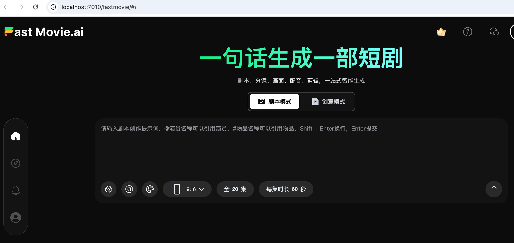
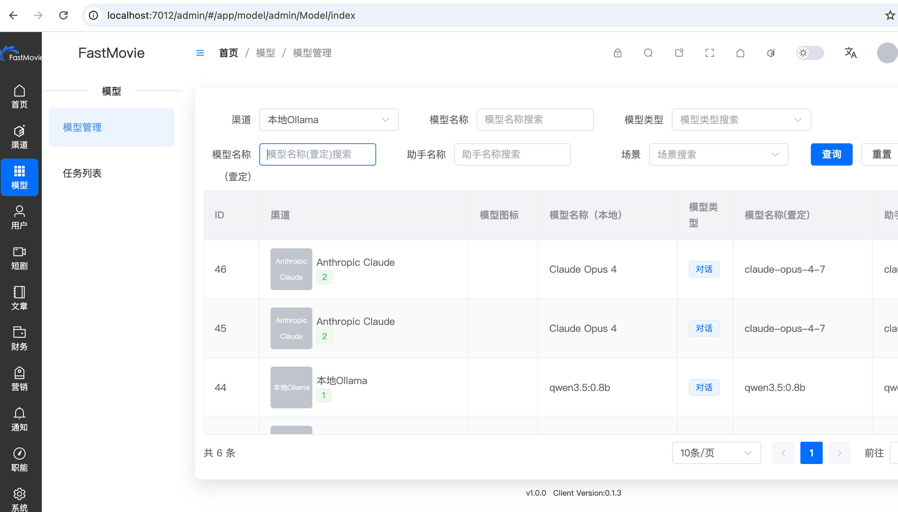

<div align="center">

# ai-FastMovie

**可商用的一站式 AI 短剧创作平台**

[English](README.md) | [简体中文](README.zh.md)


</div>

---

## ✨ 项目简介

ai-FastMovie 是一个功能完整、可直接商用的开源短剧/短视频创作平台，采用前后端分离架构。平台集成 AI 剧本生成、虚拟角色管理、语音合成、视频编辑、支付系统、用户体系等完整模块，适合内容创作者、短剧团队和影视公司使用。

<div align="center">
  
  
</div>

### 🎯 核心能力

| 功能 | 说明 |
|------|------|
| 🎬 **AI 视频创作** | AI 驱动的短剧视频生成与智能剪辑 |
| 🎭 **角色管理** | 虚拟角色创建、形象配置与统一管理 |
| 🎙️ **语音合成** | 多语言 TTS 语音合成与配音 |
| 📝 **剧本编辑** | 可视化分镜头管理与剧本创作 |
| 💰 **支付体系** | 支付宝、微信支付无缝对接 |
| 👥 **会员系统** | 用户注册登录、VIP 等级、积分充值 |
| 🔌 **插件架构** | 模块化设计，按需启用/禁用 |
| 🌍 **多语言** | 中英文界面一键切换 |

### 🏗️ 技术栈

**后端**
- PHP 8.1+ / Webman 2.1+（基于 Workerman 的高性能框架）
- MySQL 8.0+ / Redis
- ThinkORM / ThinkTemplate
- Yansongda/Pay（支付）、php-ffmpeg（视频）、webman/push（WebSocket）

**前端**
- Vue 3.5+（Composition API）/ TypeScript 5.9+
- Vite 7.1+ / Element Plus 2.11+
- Pinia 3.0+ / Vue Router 4.5+

---

## 🚀 快速开始

### 环境要求

- **推荐**: Docker + Docker Compose（一键部署）
- **手动部署**: PHP ≥ 8.1、MySQL ≥ 8.0、Redis、Node.js LTS

### 方式一：Docker 一键部署（推荐）

```bash
git clone https://github.com/larack8/ai-FastMovie.git
cd ai-FastMovie

# 启动全部服务
docker-compose up -d
```

启动后自动拉起完整服务栈：

| 服务 | 容器 | 端口 | 说明 |
|------|------|------|------|
| Gateway | fastmovie-gateway | 7010 | API 网关入口 |
| Frontend | fastmovie-frontend | 7011 | Vue 前台 |
| Admin API | fastmovie-admin | 7012-7014 | 后端 API + WebSocket 推送 |
| MySQL | fastmovie-mysql | 7015 | 数据库 |
| Redis | fastmovie-redis | 7016 | 缓存 |

访问地址：
- **前台**: http://localhost:7010
- **后台管理**: http://localhost:7012/admin/
- **默认账号**: admin / 123456

> ⚠️ 首次登录后请立即修改默认密码！

### 方式二：手动部署

```bash
git clone https://github.com/larack8/ai-FastMovie.git
cd ai-FastMovie

# 1. 启动后端
cd fastmovie-admin
cp .env.example .env        # 编辑数据库和 Redis 配置
php start.php start -d       # 守护进程模式启动

# 2. 启动前端（新终端）
cd ../fastmovie-vue
npm install
npm run dev                 # 开发服务器，默认端口 36310
```

也可访问 `http://你的域名/install` 使用 Web 安装向导，自动完成环境检测、数据库初始化、配置文件生成。

### 项目结构

```
ai-FastMovie/
├── fastmovie-admin/          # 后端 (PHP/Webman)
│   ├── app/                  # 应用代码
│   ├── config/               # 配置文件
│   ├── plugin/               # 插件模块
│   ├── public/               # Web 入口
│   └── start.php             # 启动入口
├── fastmovie-vue/            # 前端 (Vue3/TypeScript)
│   ├── src/                  # 源码
│   └── vite.config.ts
├── docker/                   # Docker 配置 (nginx)
├── docker-compose.yml        # 编排文件
├── start.sh                  # 部署辅助脚本
└── README.md
```

---

## 🔧 配置说明

### 环境变量 (.env)

`fastmovie-admin/.env` 关键配置项：

| 变量 | 默认值 | 说明 |
|------|--------|------|
| `SERVER_PORT` | 7012 | 后端监听端口 |
| `DATABASE_HOST` | mysql | 数据库主机（Docker 内用容器名） |
| `DATABASE_PORT` | 3306 | 数据库端口 |
| `DATABASE_NAME` | ai_short_play | 数据库名称 |
| `REDIS_HOST` | redis | Redis 主机 |
| `REDIS_PORT` | 6379 | Redis 端口 |
| `PUSH_API_PORT` | 7013 | WebSocket 推送 API 端口 |
| `PUSH_WSS_PORT` | 7014 | WebSocket WSS 端口 |

### 插件系统

ai-FastMovie 采用模块化插件架构，各插件独立运行：

| 插件 | 功能 |
|------|------|
| **user** | 用户管理与身份认证 |
| **finance** | 支付与财务管理 |
| **marketing** | 营销推广工具 |
| **article** | 内容管理系统 |
| **shortplay** | 短剧创作核心功能 |
| **model** | AI 模型接入与管理 |
| **notification** | 消息通知与推送 |
| **control** | 平台控制台与全局配置 |

可根据业务需要灵活启用或禁用插件。

---

## 📖 文档 & 常用命令

- [后端开发文档](./docs/backend-development.md) — Webman/PHP 开发指南
- [前端开发文档](./docs/frontend-development.md) — Vue3/TypeScript 开发指南

### 常用命令

```bash
# 后端
cd fastmovie-admin
php start.php start     # 启动
php start.php stop      # 停止
php start.php restart   # 重启
php start.php status    # 查看状态
php webman              # 查看所有可用命令

# 前端
cd fastmovie-vue
npm run dev             # 开发服务器
npm run build           # 生产构建
vue-tsc --noEmit        # 类型检查
```

### 生产环境部署要点

1. **宝塔面板**（推荐）：创建站点 → 运行目录设为 `fastmovie-admin/public` → PHP ≥ 8.1 → 配置伪静态（复制 `nginx.example` 内容）→ 进程守护添加启动命令
2. **Nginx 手动部署**：参考 `fastmovie-admin/nginx.example` 配置反向代理，注意替换 `PUSH_KEY` 为实际值
3. **安装完成后务必删除** `public/install` 目录

---

## 🤝 参与贡献

欢迎各种形式的贡献：提 Issue、建议新功能、改进文档、提交代码。

1. Fork 本仓库
2. 创建特性分支: `git checkout -b feature/amazing-feature`
3. 提交更改: `git commit -m '添加某个很棒的功能'`
4. 推送分支: `git push origin feature/amazing-feature`
5. 提交 Pull Request

**规范**：后端遵循 PSR-12，前端使用 ESLint + Prettier，提交信息清晰描述改动。

---

## 📄 开源协议

[Apache License 2.0](./LICENSE)

## ⚠️ 免责声明

本项目仅供学习和研究使用，使用者需自行承担相关责任，请遵守法律法规。

---

## 💬 联系我们

- **邮箱**: larack@126.com
- **Issue 反馈**: [GitHub Issues](https://github.com/larack8/ai-FastMovie/issues)

<div align="center">

<table>
  <tr>
    <td align="center">
      
      <br />
      <b>用户交流群</b>
      <br />
      <span>扫码加入，与创作者一起交流</span>
    </td>
    <td align="center">
      
      <br />
      <b>技术咨询 & 商务合作</b>
      <br />
      <span>扫码联系，洽谈合作事宜</span>
    </td>
  </tr>
</table>

<br />

如果这个项目对你有帮助，欢迎给个 ⭐️ Star！

Made with ❤️ by ai-FastMovie Team

</div>
